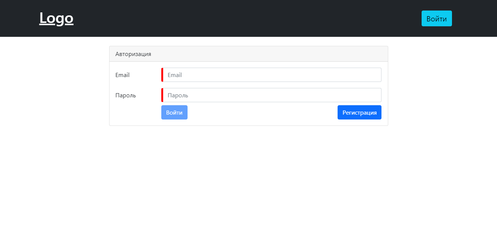
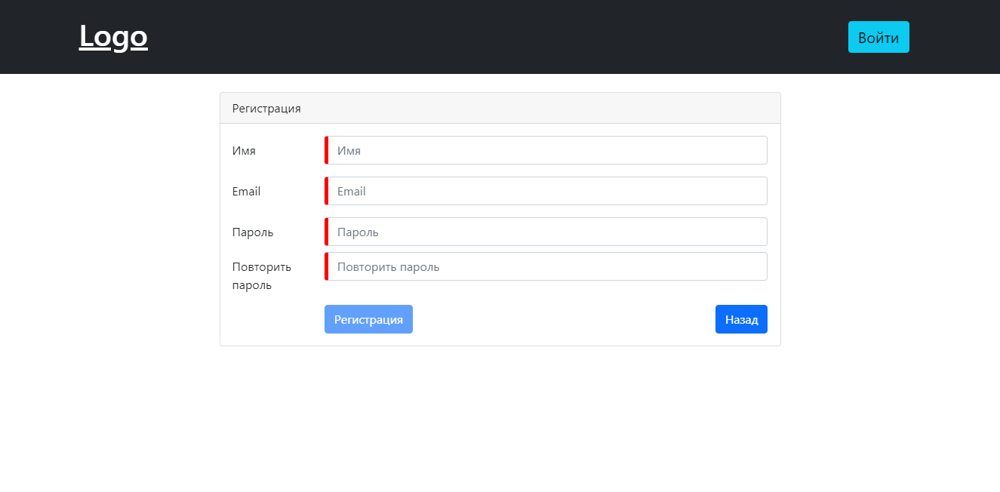

# Авторизация laravel + Angular + JWT

> <a href="https://youtu.be/TK9dFTmKJRE">Видео обзор</a> <br/>





# Установка

> Frontend 

`cd frontend` `npm install`

> Backend

`cd backend` `composer install` 

связка с бд `.env`

```
DB_CONNECTION=mysql
DB_HOST=127.0.0.1
DB_PORT=3306
DB_DATABASE=имя бд
DB_USERNAME=имя пользователя 
DB_PASSWORD=пароль
```
После подключение введи `php artisan migrate`

> Теперь нужно запустить Backend и frontend <br>
>
> Angular -> frontend `ng s -o` <br>
> Laravel -> backend `php arisan serve`


