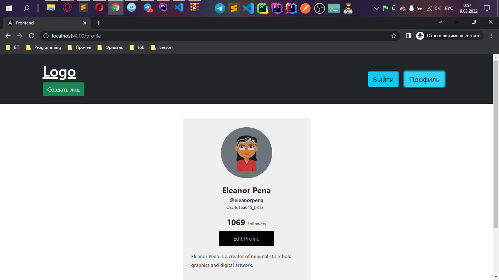

# Авторизация laravel + Angular + JWT

> <a href="https://youtu.be/TK9dFTmKJRE">Видео обзор</a> <br/>





# Установка

> Frontend 

`cd frontend` `npm install`

> Backend

`cd backend` `composer install` 

`npm install` или `yarn` (Смотри папку **node_modules**)

Изменить `.env.example` на `.env`

Генерация APP_KEY
`php artisan key:generate`


## Подключение к DataBase `.env`
```
DB_CONNECTION=mysql
DB_HOST=localhost
DB_PORT=3306
DB_DATABASE=Имя бд
DB_USERNAME=Имя пользователя 
DB_PASSWORD=Пароль пользователя
```

## Выполнение Миграций
```
php artisan migrate
```

## Генерация JWT ключа
```
php artisan jwt:secret
```


## Запуск
Laravel -> backend `php arisan serve` <br>
Angular -> frontend `ng s -o` <br>


